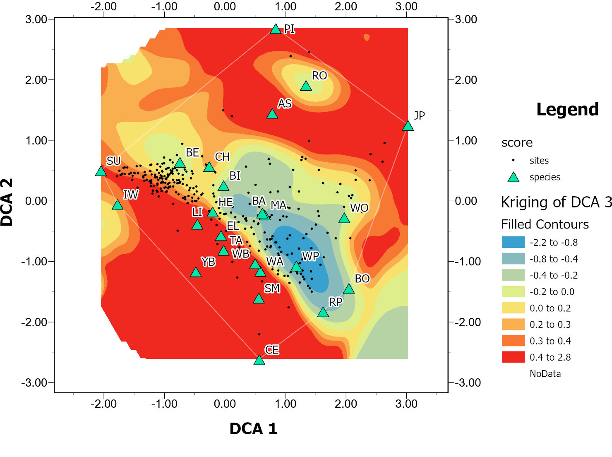

<style>
  .klippy-btn {
    font-size: 24px; /* Adjust size */
    padding: 6px 10px; /* Increase button padding */
  }
</style>

The following packages are required...

```{r message = FALSE, warning= FALSE}

library(data.table)
library(vegan)
library(labdsv)
library(tidyverse)
library(janitor)
library(ggplot2)
library(remotes)
library(interp)
library(tidyr)
remotes::install_github("rlesur/klippy")
library(klippy)
library(knitr)
library(here)

#an additional package not on CRAN, which is helpful for plotting DCA data, can be installed as well... Comment out the remotes call if package is already installed...
remotes::install_github("gavinsimpson/ggvegan")
library(ggvegan)
```

```{r klippy, echo=FALSE, include=TRUE}
klippy::klippy(position = c("top", "right")
)
```

## Background

Presettlement vegetation maps provide a valuable snapshot of forest communities before widespread settlement and subsequent land disturbance by European settlers. In glaciated regions like Michigan, where many species naturally exhibit a wide ecological amplitude (i.e., they can occur across various soil types), disturbances such as wind and fire—further shaped by soil characteristics, climate, and topography—are considered the primary drivers of forest community composition at any given point in time and space.  In turn, forest species dominance in a particular area has a notable impact on soil morphology over century time scales (i.e, "pedological memory", Phillips and Marion (2004)).

For over four decades, pre-settlement vegetation maps- derived from original Government Land Office (GLO) Survey Records- have served as an invaluable link to the past, informing conservation management at the federal, state, and local levels, as well as within nonprofit organizations. These maps provide insight into the landscape as it existed more than a century ago under a 'natural' disturbance regime (Leahy and Pregitzer, 1996). Pre-settlement vegetation maps are typically represented as polygons denoting forest classes. Michigan's presettlement vegetation map (Comer et al. 1995) was manually delineated based on transcribed notes from the original surveyors that traversed the State to monument section corners during layout of the Public Land Survey System (PLSS) grid in the mid to late 1800s.  An online version of the map is [available here](https://mnfi.maps.arcgis.com/apps/webappviewer/index.html?id=bbdca9029f184571bd0369cb4aa90cd2).

Advancements in modern spatial predictive modeling techniques now allow the use of the presettlement tree database to derive quantitative representations of ecotones (e.g., pyrophilic percent maps from Van Gundy et al., 2015). For this project, deriving raster ecotone gradients produces a continuous quantitative variable that enhances predictive modeling of soil properties (e.g., spodic intensity) and terrestrial ecological communities.


## GLO Presettlement Trees Sample Ordination Methods

This document describes the methods used to conduct Detrended Correspondence Analysis (DCA) on GLO pre-settlement tree survey data for an example soil survey spatial update project currently being conducted by the Grand Rapids MLRA Soil Survey Office (2025). These methods aim to replicate the findings of Delcourt and Delcourt (1996), incorporating modern techniques. The GLO data were used to generate a raster representing a continuous ecotone gradient for use as a covariate in a digital soil mapping framework. This workflow may be applicable to other regions or states with a digitized historic GLO tree survey layer.

The workflow is broken into three general parts:

1.  Sample and prepare data table of GLO species data in ArcGIS Pro

2.  Ordinate GLO species data in R using Detrended Correspondance Analysis (DCA)

3.  Join DCA results and run ordinary kriging between DCA values in ArcGIS Pro

## Sample and prepare data table of GLO species data in ArcGIS Pro

### Subset GLO Data

The HUC12 watershed boundaries that intersect the project area were used to subset the GLO pre-settlement tree data for modeling. To include trees beyond the watershed boundaries, a 1,000-meter search radius was applied. The GLO data structure stores witness tree information in the same record (row) as the associated corner tree. Each record can store up to four additional witness trees, with separate columns for their bearings and distances from the corner tree. These additional witness tree data were exported as separate shapefiles, one for each species column (additional species 2 through 4).

To ensure completeness, the four shapefiles were cleaned by removing empty records, since some corner locations do not contain four witness trees. The cleaned shapefiles were merged into a single dataset, generating individual spatial occurrences for all trees. While witness trees share the same geometry as corner trees, their precise locations do not impact the analysis at this scale.

### Generate Artificial Plot Boundaries Around GLO Data

The [Generate Tessellation](https://pro.arcgis.com/en/pro-app/latest/tool-reference/data-management/generatetesellation.htm) tool was used to generate "plot" boundaries around the GLO data. The shape type was set to transverse hexagon. Size was set to 1 square mile. The processing extent was set to the same as the subset GLO data. Next, using the Select By Location tool, hexagons that contain GLO point data were selected and exported to a new shapefile.

```{r fig.align="center", fig.cap="**Fig. 1**- Map showing subset of GLO trees (green points) within the project area (black outline).  Choropleth map below right show the number of trees within each cell"}
knitr::include_graphics("Figures/Fig1.jpg")
```

### Summarize Species by Grid Samples

The hexagon tessellation tool generates a unique grid ID for each heaxagon. This "GRID_ID" field was used to associate a unique spatial identifier to HMNF GLO Tree samples using the Spatial Join tool with a one-to-many join operation. Next, the [Frequency](https://pro.arcgis.com/en/pro-app/latest/tool-reference/analysis/frequency.htm) tool was used to summarize the number of species occurrences within each hexagon (by "GRID_ID"). The result was exported to a .csv table for further processing with R. Essentially, the exported table is a species-by-sample table, appropriately structured for a variety of multivariate analyses with community ecology data.

## Ordinate GLO species data in R using Detrended Correspondance Analysis (DCA)

This section is intended to illustrate the data processing steps within R. Users can follow along with their own data by copying script chunks below, substituting their own files and file paths as appropriate.  Set the working directory according to where you exported the table from part 1 above. Read in the species by sample data table.

```{r message = FALSE, warning= FALSE}

#read .csv file
GLO<- read.csv(here("GLO_SpeciesBySample.csv"))

#read species codes lookup file
SP<- read.csv(here("SpeciesCodes.csv"))
```

The GLO data table needs to be reformatted slightly to make it appropriate for future steps. We'll use the dcast function to reorganize the table to wide format, and summarize the frequency of each species within the plot. Next the hexagon GRID_IDs are used to update the row names. Finally, the redundant column containing the GRID_IDs is removed.

```{r message = FALSE, warning= FALSE}
#first set GLO dataframe as a data table in order to use dcast...
setDT(GLO)

#reshape the table to wide format, species by sample...
GLOwide<- dcast(GLO, GRID_ID ~ SPP, fun.aggregate = sum, value.var = 'FREQUENCY')

#convert back to data frame for additional functionality later...
GLOwide<- as.data.frame(GLOwide)

#update row names to be species names...
row.names(GLOwide)<- GLOwide$GRID_ID

#remove redundant GRID_ID Column...
GLOwide2<- (GLOwide[,-1])
```

This optional code section helps reduce the influence of outlier species on ordination results. Various minimum species occurrence thresholds can be tested by adjusting the percentage value in the *minval* parameter of the vegtab function. For this project, a threshold of 0.5% was set for the *minval* parameter, reducing the total number of species in the dataset from 27 to 24.


```{r message = FALSE, warning= FALSE}
#drop species that are present in less than 1/2 percent of all samples...

GLOwide3<- vegtab(comm = GLOwide2, minval = (0.005 * nrow(GLOwide2)))

```

Next, the frequency data are converted to percentages using the adorn_percentage function from the janitor package. The last argument ensures that all columns are used, allowing the function to convert the first column to a percentage (by default, the function excludes the first column from the data matrix).

```{r message = FALSE, warning= FALSE}
#update counts of species to percentage by sample... If re-using code, first make sure the number of variables in your verison of GLOwide3 matches the script below...

GLOwide4<- adorn_percentages(GLOwide3, denominator = "row", na.rm = FALSE, c(1:24))

#check for NaN values.  Remove sites with NaN values for all species...
GLOwide5<- na.omit(GLOwide4)
```

Take a look at summary statistics for the species percentages to ensure the data looks correct...

```{r GLOwide4, results='hide'}
summary(GLOwide5)
```

The next 3 chunks of code conduct the detrended correspondence analysis and use a couple different methods to visualize the results. Because DCA is an indirect gradient analysis, concerning only sample data itself, the interpretation of the results is up to the researcher.

```{r message = FALSE, warning= FALSE}

#perform detrended correspondence analysis on the final matrix..
GLO_DCA<- decorana(GLOwide5)
```

```{r fig.cap= "**Fig.2** - Facet plot of the sites and species ordination side by side", echo=TRUE, warning = FALSE, fig.align='center', fig.width=15, fig.height= 12}
#reformat the DCA results to be able to pass it to a faceted plot showing both the species and site ordinations...
GLO_DCA.gg <- fortify(GLO_DCA)


ggplot(data = GLO_DCA.gg, aes(x = DCA1, y = DCA2)) +
  geom_point(data = subset(GLO_DCA.gg, score == "sites"), aes(colour = score), size = 3) +  # Points for sites
  geom_text(data = subset(GLO_DCA.gg, score == "species"), aes(label = label, colour = score), size = 5, vjust = -1) +  # Text for species
  facet_grid(facets = . ~ score) +
  theme_bw() +
  theme(axis.title.x = element_text(size = 16),  # Adjust axis title size
        axis.title.y = element_text(size = 16),
        axis.text.x = element_text(size = 14),  # Adjust x-axis text size
        axis.text.y = element_text(size = 14),
        strip.text = element_text(size = 16, face = "bold"))  # Adjust facet heading size
```

<a href="#tbl-appendix">Table 1</a> contains species codes, common names, and scientific names.  Evaluating the 24 most common species in the dataset and ordination plot, I interpret DCA Axis 1 as representing a pyrophilic and shade tolerance gradient. SU (Acer saccharum—sugar maple) and IW (Ostrya virginiana—ironwood) fall on the pyrophobic/shade-tolerant side of the gradient (low DCA 1 values), while JP (Pinus banksiana—jack pine) is positioned on the pyrophilic/shade-intolerant side (high DCA 1 values).  I interpret DCA Axis 2 as potentially representing a soil moisture gradient, with CE (Thuja occidentalis—eastern white cedar) and SM (Acer rubrum—red maple) on the wet end (corresponding to low DCA 2 scores), and generic pine species (PI) and RO (Quercus rubra- Northern red oak) on the dry end (corresponding to high DCA 2 scores).

```{r fig.cap= "**Fig.3** - Ordination results of just the species data, labeled by species codes", echo=TRUE, fig.align='center', fig.width=15, fig.height= 12, tidy=TRUE}
# As an alternative rendering with more focus on just the species, use the autoplot function from the ggvegan package and use the species labels for more context...

species_scores <- fortify(GLO_DCA, display = "species")  # Extract species scores

p1 <- autoplot(GLO_DCA, axes = c(1,2), display = "species", geom = "text", cex = 0.5, 
               title = "Detrended Correspondence Analysis plot for presettlement tree species across project area", 
               subtitle = "DCA 1 vs DCA 2") +
  
  geom_text(data = species_scores,  # Use extracted species scores
            aes(x = DCA1, y = DCA2, label = label),  # Label column contains species names
            fontface = "bold", color = "black", size = 5) +  

  theme(axis.text = element_text(size = 14, color = "black"),  
        axis.title = element_text(size = 16, face = "bold", color = "black"),  
        plot.title = element_text(size = 18, face = "bold", color = "black"),  
        plot.subtitle = element_text(size = 16, face = "bold", color = "black"))  

plot(p1)
```

This next chunk of code exports the results of the DCA for the sites to a table. The DCA scores for each sample site get assigned to the centroids of the original sample hexagon (sample unit). The values for each of the three DCA axes are then contoured to represent the ecotone gradient.

```{r message = FALSE, warning= FALSE}

#write the DCA results to a table -update path accordingly.

## Not run:
#write.csv(GLO_DCA.gg, file = #"D:\\GLO_Modeling\\GLO_ModelingGLO_DCA.gg.csv")
## End(Not run)
```

This table can also be used in ArcGIS Pro to take advantage of the enhanced graphical capabilities of ArcPro Layouts. After all, DCA data are numerical, similar to WGS coordinates. Why not plot them in an empty map and treat them as spatial coordinates? For example, instead of viewing only the DCA 1 and DCA 2 axes as in Fig. 3 above, apply ordinary kriging to interpolate DCA 3 scores and visualize the data cloud in three dimensions (Fig. 4).

Viewing the 3rd dimension allows for speculation and testing of previously unseen ordination in the data cloud.  For example, the 3rd dimension cloud be interpreted as a surface water/groundwater dependence gradient, with BA (Fraxinus nigra- black ash)on the surface water-dependent end (corresponding to low DCA 2 scores), and CE (Thuja occidentalis—eastern white cedar) on the groundwater-dependent end (corresponding to high DCA 2 scores).

```{r fig.align="center", fig.cap="**Fig. 4**- Three-dimensional Detrended Correspondence Analysis (DCA) plot rendered in ArcGIS Pro Layout. The filled contours represent DCA3 axis scores. Ordinary kriging was used for interpolation between site points. The thin white line around the data points is a convex hull to delineate the range of reasonable kriging data for DCA 3"}

```


## Join DCA results and run ordinary kriging between DCA values in ArcGIS Pro

Add the GLO_DCA.gg.csv table to ArcGIS Pro and open it to review the fields. Join the Field1 column to the GRID_ID field from the original hexagon tessellation. If outliers with less than 0.5% occurrence were removed from the dataset, some hexagon samples may lack a DCA1 value. To remove null values from future steps, use a definition query to display only features where DCA1 is not null.

The centroid of each hexagon grid sample is generated using the [Feature to Point](https://pro.arcgis.com/en/pro-app/latest/tool-reference/data-management/feature-to-point.htm) tool, with the "inside" option checked. This step creates a point dataset suitable for kriging the DCA axis scores for each sample site. The point data is then processed using ordinary kriging in the Geostatistical Wizard. For this analysis, the following Geostatistical Wizard options and parameters were selected...

-   No data transformations

-   Method = Kriging

-   Type = Ordinary

-   Output type = Prediction

-   Search neighborhood = smooth

-   Smoothing factor = 0.2

-   The "optimize model" button was chosen for each, to set semivariogram parameters specific to each DCA axis.

Finally, each kriged GA Layer was exported to raster using the [GA Layer to Rasters](https://pro.arcgis.com/en/pro-app/latest/tool-reference/geostatistical-analyst/ga-layer-to-rasters.htm) tool. The output cell size was set to 5 meters, and the output coordinate system was set NAD 1983 UTM Zone 16N (EPSG:26916) to match the pixel alignment of other covariates used in the modeling effort.  

## Results

Figures 5-7 below preview the results for the kriged DCA axes 1-3. The small dots (sites) mark the points around which DCA values were kriged. The ecotone gradients represent the location of each sample of GLO trees along the respective DCA axis in species-space. The predicted change between point values reflects species occurrence turnover rates across a continuous gradient. Each contour line represents approximately a 12.5% species turnover rate. Therefore, a separation of eight contour lines indicates a 100% species difference between two locations.

High DCA 1 values in the southern and southeastern portions of the project area align with known nutrient-poor Typic Udipsamment soils on a flat outwash fan (Fig. 5). Historically, this area likely burned more frequently than the morainic uplands to the east. The sandy outwash extends north into the central portion of the project area, where dry, sandy soils continue to dominate. Common species in the GLO data here include jack pine, red pine, and white oak.

This project area also contains the boundary between the mesic and frigid soil temperature regimes. As a result, the species ecotone shifts toward the cooler end of the spectrum (low DCA 1 values), where presettlement hardwoods such as sugar maple, beech, and ironwood predominated.

```{r fig.align="center", fig.cap="**Fig. 5**- Results of ordinary kriging of DCA 1 values of sites in the GLO data set.  Color ramp is distributed among 8 quantile breaks in the data."}
knitr::include_graphics("Figures/DCA1map.jpg")
```
Low DCA 2 values in Fig. 6 appear clustered in and around riparian and wetland areas, particularly where groundwater is shallow. The ordination along the DCA 2 axis likely represents a gradient of groundwater and surface water dependence. Common species at the groundwater-dependent end (low DCA 2 scores) include eastern white cedar, red maple, and, to a lesser extent, ash species. In contrast, areas with high DCA 2 scores are typically clustered in upland locations with sandy or loamy sand textures and high precipitation recharge. Typical species in these areas include generic pine (most likely red pine or white pine).

```{r fig.align="center", fig.cap="**Fig. 6**- Results of ordinary kriging of DCA 2 values of sites in the GLO data set.  Color ramp is distributed among 8 quantile breaks in the data."}
knitr::include_graphics("Figures/DCA2map.jpg")
```

The interpolation of DCA 3 values is more difficult to interpret (Fig. 7). Areas with high DCA 3 scores tend to be situated on flat footslopes at the base of major uplands or in landscape positions that are otherwise topographically protected. Species associated with high DCA 3 scores are similar to those found at the low end of DCA 2, including eastern white cedar and black ash. Conversely, areas with low DCA 3 scores tend to contain white pine, red pine, beech, and maple, are situated in more upland morainal landscapes, and exemplify mixed conifer-deciduous forests as recorded in the General Land Office (GLO) surveys.


```{r fig.align="center", fig.cap="**Fig. 7**- Results of ordinary kriging of DCA 3 values of sites in the GLO data set.  Color ramp is distributed among 8 quantile breaks in the data."}
knitr::include_graphics("Figures/DCA3map.jpg")
```
## Summary

The results demonstrate a reasonable ecological coherence between broad-scale geomorphology, soils, and tree occurrence during presettlement times, offering a realistic gradient that captures the continuous, nuanced nature of species occurrence. Such models can serve as covariates in a digital soil mapping or terrestrial ecological unit mapping framework, and are especially helpful in sand-dominated glaciated areas where species occurrence is more a function of disturbance regime than soil or site characteristics. Although more sophisticated multivariate statistical tools are available today, ecological models using indirect gradient analysis—such as DCA—remain highly useful when the input data and project area are already well understood. If you have questions, feedback, or comments on this workflow, please feel free to reach out to me [via linkedIn](https://www.linkedin.com/in/trevor-c-hobbs).

## References

Comer, P.J., D.A. Albert, H.A. Wells, B.L. Hart, J.B. Raab, D.L. Price, D.M. Kashian, R.A. Corner & D.W.
 Schuen (map interpretation); T.R. Leibfreid, M.B. Austin, C.J. DeLain, L. Prange-Gregory, L.J. Scrimger,
K.M. Korroch, & JG. Spitzley (digital map production). 1995. "Michigan’s Presettlement Vegetation, as Interpreted from the General Land Office Surveys 1816-1856." Michigan Natural Features Inventory, Lansing,
MI. digital map.

Delcourt, H. R., & Delcourt, P. A. (1996). "Presettlement landscape heterogeneity: Evaluating grain of resolution using General Land Office Survey data." *Landscape Ecology*, *11*(6), 363--381. <https://doi.org/10.1007/BF02447523>

Leahy, Michael J., and Kurt S. Pregitzer. “A Comparison of Presettlement and Present-Day Forests in Northeastern Lower Michigan.” The American Midland Naturalist, vol. 149, no. 1, 2003, pp. 71–89. JSTOR, <http://www.jstor.org/stable/3083176>

Phillips, J.D. and Marion, D.A (2004). "Pedological memory in forest soil development." Forest Ecology and Management,
Volume 188, Issues 1–3, Pages 363-380, ISSN 0378-1127, <https://doi.org/10.1016/j.foreco.2003.08.007>

Thomas-Van Gundy, Melissa A.; Nowacki, Gregory J.; Cogbill, Charles V. (2015). "Mapping pyrophilic percentages across the northeastern United States using witness trees, with focus on four national forests." Gen. Tech. Rep. NRS-145. Newtown Square, PA: U.S. Department of Agriculture, Forest Service, Northern Research Station. 26 p

## Appendix {#appendix}

<a id="tbl-appendix"></a>
**Table 1:** The following table contains species codes, common names, and scientific names.
```{r tbl-appendix, fig.align="center"}
# Render a neat table
kable(SP, col.names = c("Species Code", "Common Name", "Scientific Name"), align = "l")
```

